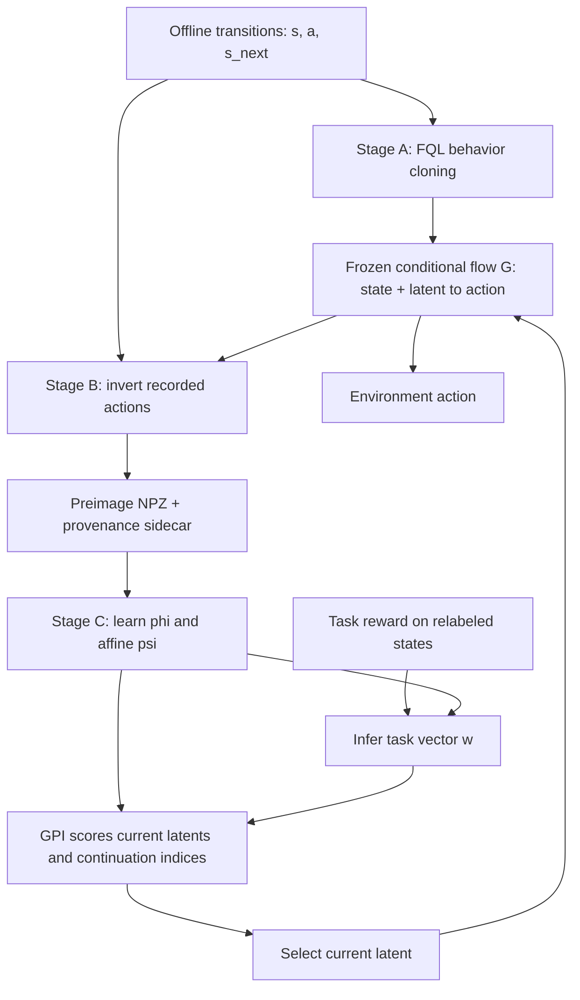

# PSMFlows project map

Orientation snapshot: **2026-09-11**, branch `feat/inversion-integration`, HEAD `c859fe4`.
The working tree already contains substantial uncommitted research changes. This map
includes those changes where inspected; HEAD alone does not reproduce the observed code.
Latest lab entry: **2026-09-11**. Historical results below were not rerun during orientation.
The action-conditioning campaign completed: cube43.92% ±38.02points and AntMaze1.08%
±1.46points at500k (five-task means, three-seed95% t halfwidths). The target was not met.
The paired freeze-phi diagnostic is implemented. Its 200-step H100 smoke passed (job2494102)
and the matched 50k-to-500k production pair is running as job2494139; final results are
pending. Interim 50-episode task1 values are mixed (.70/.36 frozen/control at100k, then
.10/.18 at150k), so no conclusion is drawn yet.

## Read this first next time

| Source | Purpose |
|---|---|
| [CLAUDE.md](../CLAUDE.md) | Workflow, pipeline, launch and reporting rules |
| [.claude/rules/mistakes.md](../.claude/rules/mistakes.md) | Preserve scope, inspect existing implementations, verify changes, report actual failures |
| [README.md](../README.md) | Public overview and command examples |
| [COMPENDIUM.md](COMPENDIUM.md) | Theory, historical evidence, hypothesis index; several sections describe older arms |
| [HANDOFF.md](HANDOFF.md) | Dated lab record; read newest entries before older interpretations |
| [reference/psmflow-symbols.md](reference/psmflow-symbols.md) | Code/paper notation and loss conventions |
| [PREIMAGES.md](PREIMAGES.md) | Artifact download, pairing, inversion, training, evaluation, continuation |
| [design/2026-09-08-critic-signal-and-dsrl-na.md](design/2026-09-08-critic-signal-and-dsrl-na.md) | Recent critic/readout experiments and revisions |
| [design/2026-09-08-oscillation-stability.md](design/2026-09-08-oscillation-stability.md) | Stability campaign |
| [design/2026-09-11-affine-action-conditioning.md](design/2026-09-11-affine-action-conditioning.md) | Current action-conditioned affine experiment, mathematical limits, and TD-JEPA comparison protocol |
| [design/2026-09-11-freeze-phi-diagnostic.md](design/2026-09-11-freeze-phi-diagnostic.md) | Next causal test: confirm early AntMaze performance, then compare matched continuations with and without feature learning |

The two repository-local Claude guidance files found were `CLAUDE.md` and
`.claude/rules/mistakes.md`. The linked research documents supply most of the durable memory.
For current behavior, inspect code and the run's own `flags.json`; for experimental
conclusions, follow dated corrections and the underlying evaluation reports.

## Mental model

The goal is **zero-shot offline reinforcement learning**: learn a reward-free representation
from a fixed dataset, then answer a supplied reward through task inference without retraining
the representation. The central proposal is to express actions and continuation policies in
the latent space of a frozen behavior-cloned flow.

| Object | Meaning and implementation |
|---|---|
| `G(s,u)` | Frozen decoder; `flow_vf` for ODE integration or `flow_onestep` for distilled decode |
| `u` | Current action latent; training normally uses the recorded action's point preimage |
| `u'` | Continuation-policy index, independently drawn per training row; held fixed in the policy being represented |
| `phi(x)` | Basis over future states, `PhiMap` |
| `psi(s,u,u')` | Successor features, default `AffinePsiMap`: `A(s,u)^T w(u') + beta(s,u)` |
| `w(u')` | Learned policy-index coordinate inside the affine head; distinct from the task vector |
| Task `w` | Reward readout `E[r phi]`, called `task_z` in code; projected according to `norm_z` |
| `psi^T w` | Task-conditioned value used for GPI |

Stage C fits a contrastive successor-measure loss plus basis orthonormality and target
updates. Under the default latent index, the backup uses `psi_target(s_next,u',u')`.
Acting draws separate panels of current latents and policy indices and maximizes the
ensemble-adjusted value over pairs, then decodes the selected current latent.

The default-off `measure_action_input=action` branch fits recorded actions directly in
`A(s,a), beta(s,a)` and decodes latent queries before scoring. It retains the affine policy
index, frozen flow, and reward-free training. Do not use raw-`psi` diagnostic calls from
`diag_gpi_selection`, `diag_actor_grad_terms`, or `diag_latent_ranking_oracle` with this
branch until those calls are adapted to `psi_b`/`_measure_input`.

The formal `C=1` bootstrap claim requires **exact behavior cloning** and an independent
prior draw. It is not an unconditional statement about trained networks, clipped Gaussian
draws, numerical/distilled decoders, GPI-selected actions, or state-distribution shift.
The formal source is available through `git show 5249267:PAPER/main.tex`; its in-sample
proposition was checked during orientation. `PAPER/ICLR/` is a developing draft with
placeholders and different notation in places, not a reliable description of every live arm.

## Where the implementation lives

| Path | Role / useful entry points |
|---|---|
| [main.py](../main.py) | Hydra configuration, environment/dataset loading, provenance guards, agent creation/restoration, training/evaluation loop, held reward refits |
| [agents/__init__.py](../agents/__init__.py) | Live registry contains only `fql` and `psmflow` |
| [agents/fql.py](../agents/fql.py) | Stage A, BC control, backward integration/Jacobian and EM proposal fitting for Stage B |
| [agents/psmflow.py](../agents/psmflow.py) | `create`, `sample_step_inputs`, `measure_loss`, optional critic/actor losses, `apply_update`, `decode`, `gpi_select`, `infer_z`, `refit_na_reward` |
| [utils/psm_networks.py](../utils/psm_networks.py) | Neural modules; losses belong in agents |
| [utils/psm_common.py](../utils/psm_common.py) | Contrastive/orthonormality losses, ensemble uncertainty, projections and target helpers |
| [utils/flow_inversion.py](../utils/flow_inversion.py) | Augmented dataset IO, inversion validity/repair and mixture sampling |
| [utils/datasets.py](../utils/datasets.py) | Batch/replay sampling and delivery of point/mixture preimages |
| [envs/env_utils.py](../envs/env_utils.py) | Environment and dataset construction, including dataset fractions |
| [tools/precompute_preimages.py](../tools/precompute_preimages.py) | Stage B driver |
| [tools/eval_checkpoint.py](../tools/eval_checkpoint.py) | Restore run-specific configuration, seeded evaluation, worker aggregation, report output |
| [tools/stability_ladder.py](../tools/stability_ladder.py) | Checkpoint/seed ladder analysis |
| [tools/diag_fitted_vs_true_return.py](../tools/diag_fitted_vs_true_return.py) | Probe intended to compare fitted and true reward returns in the same rollout |
| `tools/diag_*.py`, `tools/validate_*.py` | Mechanism probes and flow/inversion/decode/dynamics recovery gates |
| `scripts/`, `scripts/slurm/` | Local and scheduled launchers, artifact transport, evaluation |
| `tests/` | Agent, inference, inversion, config compatibility, restoration and evaluation coverage |

Stack: Python, JAX/Flax/Optax, Hydra/OmegaConf plus `ml_collections`, OGBench/MuJoCo,
W&B and CSV/JSON reporting. Historical agents and experiments live on the `archive` branch
and are not part of this one.

## Defaults and experimental branches

`agent=psmflow` selects `psi_form=affine`, `policy_index=latent`, `train_actor=false`,
`acting=gpi`, `index_agg=max`, `gpi_num_u=64`, `gpi_decode=onestep`,
`use_point_preimage=true`. The top-level Hydra config itself defaults to **`agent=fql`**.
The PSMFlow YAML discount is `0.98`; launch scripts select environment-specific values
(documented antmaze default `0.99`). Check the exact launcher and saved flags before comparing.

Optional branches include free psi, task-vector indexing, latent actors, expectile
distillation, action-space successor critics/residuals, loss stabilizers, whitened reward
inference, and multiple nearby training latents per transition. These are separate arms,
not all part of the primary algorithm.

**Naming trap:** old `actor_mode=dsrl_na` maps to `gpi_distill`, an actor imitating GPI
candidate selections. Actual `dsrl_na.enabled=true` adds an action critic `qa`, a distilled
latent critic `qw`, and a SAC actor. Its `reward_source=real` arm is task-specific;
`phi_readout` and `phi_readout_fixed` also use the task reward to fit a readout.
`synthetic_w` with `task_conditioned=true` is the zero-shot synthetic-reward variant.

## Research status to carry forward

The latest lab entries supersede the September 4 headline and several older compendium
conclusions. This is an active investigation, not an established stable win.

- **Affine GPI can improve over BC but oscillates strongly.** Cube has 500-episode
  measurements swinging from 0.086 to 0.704 within a seed. Do not quote the original
  0.532/0.620 at 250k as a converged result. Use matched seed/checkpoint ladders.
- **Cube and antmaze can be steered through the frozen flow.** The lab reports real-reward
  DSRL-NA pooled success 0.910 on cube and 0.967 on antmaze, with BC 0.072 for the cited
  controls. These are diagnostic task-specific upper bounds, not zero-shot achievements.
- **The current evidence implicates the fitted reward/value channel.** September 10 reports
  D1b fitted-reward success about 0.011, synthetic-w D2 0.004, and Arm C plus gradient actor
  0.000. The claim that stronger optimization exploits a poor fitted reward is a working
  mechanism hypothesis; comparing true and fitted rollout returns is the proposed test.
- **Arm C is not a stability fix.** Extra latents from a shrunk preimage mixture initially
  improved cube ladders, but the 1M continuation collapsed on a seed, the dose response was
  non-monotone, and antmaze did not replicate the gain. September 10 explicitly demotes it.
- **Whitening did not rescue pointmaze and could hurt antmaze.** Better reward reconstruction
  does not establish a better policy. Older comments saying whitening is a guaranteed no-op
  on cube are too strong: the lab records a modest change on a poor checkpoint.
- **Several diagnostic proxies were withdrawn.** One-step action ranking with BC continuation
  failed its expert control; top-8 expert-critic agreement lost predictive support as more
  checkpoints were added. Reward reconstruction, roster ranking, and signal/disagreement
  ratios cannot replace the 500-episode policy ladder.
- **Pointmaze is parked for a Stage-A/evaluation audit.** The lab labels it substrate-capped
  after BC scored 0/100 and Stage-C ladders scored zero. Preserve the operational decision,
  but distinguish evidence from inference: zero BC successes alone do not prove that no
  steered latent policy can succeed. Check checkpoint/goal matching before claiming a
  structural impossibility or retraining the flow.
- **Preimage mixtures are approximate local augmentation.** Their width depends on inversion
  temperature; they are not demonstrated sets of equivalent exact actions. Arm C chooses
  shrinkage using decode-error measurements on the exact artifact.

These recorded figures summarize experimental context. A publication-ready comparison must
recover matching tasks, seeds, checkpoints, episode counts, intervals and BC controls from
the underlying evaluation reports. Most historical cube headlines concern OGBench task 2;
the five-task results are a different aggregate.

## Operational invariants and documentation traps

- Import `utils.xla_guard` before JAX in executable GPU entry points: the project records
  a silent XLA autotuner miscompilation for long flow integration.
- Preimages belong to the exact flow checkpoint and dataset ordering/subset used to produce
  them. Repair downloaded sidecar paths; preserve the pairing guards. The actual `main.py`
  warns and continues when the sidecar is absent, despite stronger prose in `CLAUDE.md`.
- A `sampled_batch` inversion artifact is not training input. Stage B requires matched
  integration settings of at least 100 steps. Point inverses and mixture posterior fits
  have different sensitivities to inversion settings.
- The point inverse targets ODE decoding, while default acting uses the one-step decoder;
  do not equate exact ODE reconstruction with exact deployed reconstruction.
- `main.py` currently permits positive-prior mixture sampling when point mode is off.
  Extra measure-mixture samples use a deliberately chosen shrink and a decode-fidelity gate;
  older comments claiming an unconditional positive-prior requirement there are stale.
- Evaluation inherits the checkpoint's `flags.json`, with legacy defaults for missing old
  keys and explicit CLI overrides. Never rebuild old checkpoints from today's defaults alone.
- The `CLAUDE.md` registry paragraph names the archived agents; the live registry has two.
  Compendium line references and older “shipped/default/live” labels can be historical.
- Artifacts are documented in the private HF dataset `amsks/psmflows-preimages`; normal
  work reuses Stage A/B. Availability and live scheduler status were not checked here.
- Before a launch: show exact hyperparameters, smoke the same path for about 200 steps,
  and verify the run's saved flags. Persist diagnostic JSON. Use the applicable scheduler
  or named tmux workflow and a large artifact disk.
- Report 500-episode evaluations with seed uncertainty and the matched BC control; unstable
  arms require checkpoint spread too. In-loop evaluations are provisional. Do not hand-edit
  generated `docs/tables/results.md`; numerical work belongs in the dated handoff.

For later code changes, the repository commands are `.venv/bin/python -m pytest tests/ -x -q`
and `.venv/bin/ruff check .`; start with the relevant tests. Tests requiring real Stage-A
artifacts use `PSMFLOWS_STAGE_A_CKPT`. No tests, training runs, artifact downloads, or
external-service operations were performed for this documentation-only orientation.
